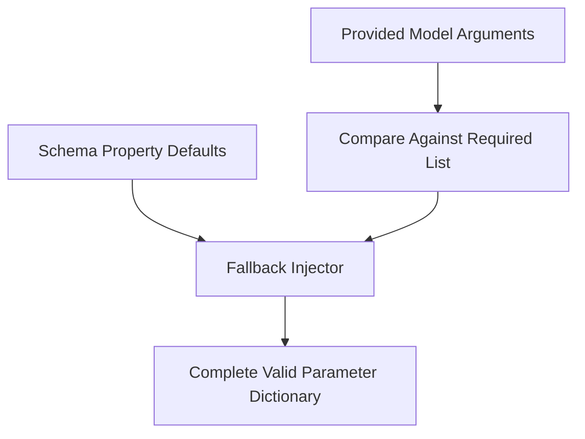

# genpark-missing-required-parameter-fallback-injector-skill

Automated fallback injector populating default values or typed nulls for missing required tool parameters.

## Architecture

## Features
- **Graceful Defaults**: Prevents tool call execution failure due to omitted optional or defaulted keys.
- **Pure Python**: 100% standard library.
